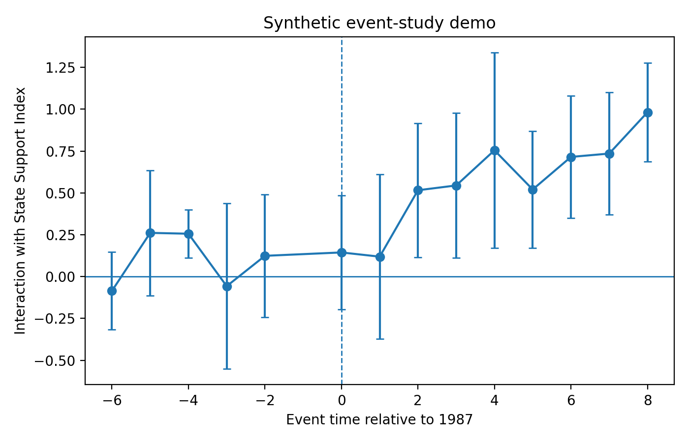

# State Coordination Reproducibility Demo

A small public demo for source-traceable policy-text measurement and event-study workflow. This repository uses **synthetic data only**. It is designed to demonstrate workflow habits rather than present final empirical results.

## What this demonstrates

An end-to-end workflow for turning unstructured documentary evidence into auditable quantitative measures: a rubric fixed before coding, source-traceable passage-level scores, benchmark validation of machine-assisted coding against hand-coded labels, explicit index construction with stated weighting and standardization choices, and a
panel event-study specification.

The substantive results here are generated from synthetic data and should not be interpreted. The workflow, the documentation standard, and the auditability are the point. The same architecture is being applied in a current project on accountability
allocation in human-agent workflows: github.com/wzhang109/Accountability_Continuity_Research

## Why this repo exists

My research asks whether inherited state coordination structures shape post-transition outcomes such as firm entry, patenting, and concentration. The main empirical challenge is measurement: how to turn policy texts, laws, industrial plans, R&D mandates, and archival passages into auditable sector-level metrics.

This demo shows a minimal version of the workflow:

1. maintain document-level source logs;
2. code archival passages using a fixed rubric;
3. validate machine-assisted scores against hand-coded benchmarks;
4. construct a sector-level support index;
5. merge the index into a sector-year panel;
6. estimate a simple event-study specification on synthetic data.

The goal is not to automate substantive judgment away. The goal is to make measurement more scalable while keeping each score traceable to documentary evidence and human review.



*Synthetic data only.* The plot shows interactions between event-time indicators and the pre-transition State Support Index, with sector and year fixed effects and k = -1 omitted as the reference period. Coefficients are not substantive results — the figure illustrates the output format of the workflow. Pre-period coefficients (left of the dashed line) are where the parallel-trends assumption is tested.

The measurement workflow is method-general and applies to two settings. The event-study specification demonstrated here is built on South Korea's 1987 democratic transition; that application is currently paused pending resolution of data availability for the sector-year outcome series. Active coding work has moved to China's post-WTO industrial policy, which is the source of the real pilot batch in data/real_*. The synthetic demo
therefore uses the Korea event structure, while the hand-coded pilot passages are Chinese policy text — the specification and the pilot data are deliberately from different settings at this stage.

## Empirical settings

This measurement approach is being developed for two independent settings.

**Setting 1 — South Korea, 1987 democratization.** Currently paused: the sector-year
outcome data required for the panel is classified and not accessible. The synthetic
demo in this repository is built around this setting, which is why event time is
indexed to 1987. May resume if data access changes.

**Setting 2 — China, 2001 WTO accession.** The active setting. The real pilot batch
codes policy text from this setting.

The synthetic demo and the real pilot batch therefore belong to different settings.
This is intentional, not an inconsistency: the demo illustrates the full pipeline
end-to-end, while the pilot batch tests the coding rubric against authentic policy
text.


## Status 

This repository combines a synthetic demo (illustrating the full workflow end-to-end) with real pilot data for one sector (automobiles), now covering both sides of the treatment boundary defined in `researchstrategy_ChinaWTO.md`:

- **Pre-treatment batch (treatment evidence):** 14 rubric-coded records from 12 passages of the 1994 Automotive Industry Policy (汽车工业产业政策, State Council, July 1994) — see `data/real_coded_passages_automobiles_1994.csv`. Includes three provisions (Articles 29, 32, 36) that reappear near-verbatim in the 2004 policy, providing direct documentary evidence for the persistence dimension.
- **Post-treatment batch (policy-response evidence, not treatment input):** 9 records from the 2004 Automotive Industry Development Policy — see `data/real_coded_passages_automobiles.csv`. Per the WTO research design, this document postdates accession and is used as outcome-side descriptive material only.

Research designs: `researchstrategy_ChinaWTO.md` (active empirical target: WTO accession as staggered liberalization shock) and the South Korea 1987 methodological note (PDF, companion design).

Not yet done: no outcome data collected; the real batches have not been run through the quantitative pipeline; only one sector coded so far.

## Repository structure

```text
state-coordination-repro-demo/
├── README.md
├── requirements.txt
├── data/
│   ├── README.md
│   ├── demo_coded_passages.csv       # created by script 00
│   ├── demo_sector_year.csv          # created by script 00
│   └── demo_support_index.csv        # created by script 01
├── docs/
│   ├── coding_rubric.md
│   ├── validation_plan.md
│   ├── prompt_log_template.md
│   └── source_log_template.csv
├── scripts/
│   ├── 00_generate_demo_data.py
│   ├── 01_construct_index.py
│   └── 02_event_study_demo.py
└── outputs/
    ├── README.md
    ├── event_study_coefficients.csv  # created by script 02
    └── event_study_plot.png          # created by script 02
```

## How to run

```bash
python -m venv .venv
source .venv/bin/activate  # Windows: .venv\Scripts\activate
pip install -r requirements.txt

python scripts/00_generate_demo_data.py
python scripts/01_construct_index.py
python scripts/02_event_study_demo.py
```

## What is auditable

- `docs/coding_rubric.md` defines coding dimensions and score meanings before analysis.
- `docs/source_log_template.csv` shows the metadata needed to trace a coded passage back to a source.
- `docs/prompt_log_template.md` gives a structured way to log AI-assisted coding runs.
- `docs/validation_plan.md` outlines benchmark construction, error analysis, and human review routing.
- `scripts/01_construct_index.py` makes the weighting and standardization choices explicit.

## Related work

This repository is the methodological ancestor of a parallel project applying the same
measurement approach to a different domain:

**[Accountability Continuity Research](https://github.com/wzhang109/Accountability_Continuity_Research)**
— an institutional framework for human-agentic task allocation. It asks which decisions
require a continuous, accountable human as AI systems become more capable, and builds an
Accountability Continuity Index using the same design pattern used here: dimensions fixed
before outcomes are examined, every score traceable to primary evidence, ambiguous cases
routed to human review, and staggered-adoption panel methods for testing.

The rubric structure is deliberately shared across both projects (dimension scores,
`coder_id`, `confidence`, `review_status`) so that measurement decisions remain auditable
in the same way regardless of subject matter.


## Limitations

This repository uses synthetic data. Coefficients, plots, and output tables should not be interpreted substantively. The repository is intended to demonstrate reproducible project structure, transparent documentation, and a workflow for scaling measurement while preserving human oversight.

The event-study coefficients and plots in outputs/ are still generated from synthetic data only; the real pilot batch in data/real_* has not yet been run through the quantitative pipeline.

Two further caveats about the specification, noted here rather than discovered later:

1. Standard errors are clustered by sector. Cluster-robust inference is asymptotic in
   the number of clusters, so with a small number of sectors these standard errors are
   downward-biased and the implied confidence intervals are too narrow. A wild cluster
   bootstrap (Cameron, Gelbach & Miller 2008) would be the appropriate correction in a
   real application.

2. The design interacts event-time indicators with a continuous exposure measure under a
   common event date. This is a differential-exposure event study, not a staggered-adoption
   design, and it requires a stronger identifying assumption than binary DiD — parallel
   trends must hold across exposure levels, not only between treated and untreated
   (Callaway, Goodman-Bacon & Sant'Anna 2024).
