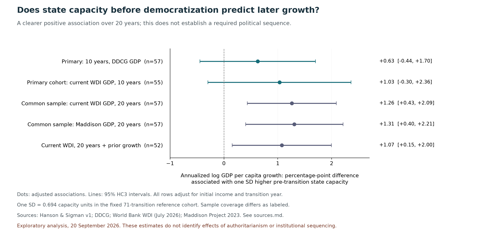

# State Capacity Before Democratization and Subsequent Growth

Exploratory findings · 20 September 2026 · Wenwen (Celine) Zhang

[中文说明](findings.zh-CN.md) · [Sources](sources.md) · [Analysis plan and amendments](ANALYSIS_PLAN.md)

**Higher state capacity before a qualifying democratic transition is positively associated with subsequent twenty-year growth in the samples examined here. Ten-year estimates are less precise. These results do not establish that capacity must be built under authoritarian rule, or that state building must precede democratization.**

This is a first exploratory analysis using public historical data, with substantial AI assistance and no independent methodological review. The research question and motivation are Celine's. The data preparation and implementation should not be presented as independently validated technical work.

## Question and scope

The original motivation concerned whether effective state institutions laid foundations for later prosperity, particularly in Asian development experiences. Four propositions need different evidence:

| Proposition | Status in this analysis |
|---|---|
| Prior state capacity predicts later economic performance | Descriptive comparisons |
| Higher capacity before a democratic transition is associated with better subsequent performance | Main transition-sample question |
| Building capacity before democratization is preferable to building it under democracy | Not identified |
| Authoritarian rule or Legalism is necessary for capacity or lasting prosperity | Not tested |

State capacity is not identical to industrial coordination, authoritarianism, or the historical Legalist tradition. The Hanson–Sigman measure includes administrative, extractive, and coercive dimensions. Twenty-year GDP growth is also only one aspect of prosperity.

## Data and sample construction

- **Hanson & Sigman v1:** state-capacity estimates for 1960–2015. The file has 177 named historical entities with estimates, represented by 175 distinct codes.
- **DDCG replication data:** Acemoglu, Naidu, Restrepo, and Robinson's regime coding and original GDP series, with regime observations for 1960–2010.
- **Maddison Project Database 2023:** alternative GDP series through 2022.
- **World Bank WDI:** GDP per capita at constant 2015 US dollars, indicator NY.GDP.PCAP.KD. The downloaded API extract was last updated 13 July 2026 and covers requested years 1960–2024.

Original sources and attribution are listed in [sources.md](sources.md); URLs, retrieval times, and hashes are in [source_manifest.json](source_manifest.json).

The primary sample uses each country's first observed qualifying 0→1 transition following at least five consecutive observed non-democratic years, from 1965 onward. This is not necessarily its first democratic transition in national history. Later reversals are retained: the sample does not require democratic survival or economic success.

Of 122 observed transitions, 88 countries have a first event meeting the time and regime conditions; 71 have five complete pre-transition capacity observations, and 57 have the original GDP endpoints for a ten-year outcome. The primary transition dates span 1965–2000.

Capacity is the mean over t−5 through t−1. Ten-year growth is 100 × [ln GDP(t+9) − ln GDP(t−1)] / 10; twenty-year growth uses t+19 and divides by 20. These are annualized log changes, not exact compound growth rates. The DDCG y variable is already 100 × ln GDP and is rescaled accordingly.

The capacity scale is fixed across transition specifications using the 71-event cohort before GDP selection: one SD equals 0.693576 raw capacity units. Models adjust for baseline log income and transition year; additional specifications include prior growth, region, or an administrative-capacity substitute. Intervals use HC3 standard errors and t critical values, except repeated-event and broader-panel checks that cluster by country.

Country-code changes are explicit. Pre-1993 Czechoslovakia capacity is not assigned to the Czech Republic; Serbia–Montenegro is not silently mapped to Serbia. Taiwan's regime sequence is present, but its original GDP is missing; Taiwan enters Maddison analyses, not the original GDP or WDI samples. Remaining historical boundary issues are a limitation.

## Main results

Estimates are percentage-point differences in annualized log GDP per capita growth associated with one SD higher pre-transition capacity, conditional on the stated controls.

| Specification | Countries | Estimate | 95% interval |
|---|---:|---:|---:|
| Original DDCG GDP, 10 years, primary | 57 | +0.63 | −0.44 to +1.70 |
| Current WDI GDP, 10 years, available primary cohort | 55 | +1.03 | −0.30 to +2.36 |
| Current WDI, 20 years, common sample | 57 | +1.26 | +0.43 to +2.09 |
| Maddison, 20 years, identical common sample | 57 | +1.31 | +0.40 to +2.21 |
| WDI common 20-year cohort, adding prior growth | 52 | +1.07 | +0.15 to +2.00 |
| WDI common 20-year cohort, excluding Korea | 56 | +1.13 | +0.33 to +1.92 |

The primary 57-country sample and the twenty-year common 57-country sample contain different countries. The last row removes Korea only; Taiwan is absent from WDI to begin with. The prior-growth row has fewer observations because prior GDP is incomplete.

The twenty-year association is not entirely driven by Korea. This does not make it causal: education, conflict, international support, trade opportunities, and other historical conditions may influence both capacity and growth. Baseline income may itself reflect earlier capacity, so controlling for it does not identify the total effect of prior capacity building.

All specifications are retained in [model_results.csv](model_results.csv) and [wdi_diagnostic_models.csv](wdi_diagnostic_models.csv), including imprecise and less favorable results. These are correlated exploratory checks, not independent confirmatory tests. No multiple-testing adjustment is applied.

## Source sensitivity and additional checks

GDP-source disagreement is substantial for some countries. For Mozambique, 1993–2003 annualized log growth is +4.24% in the original DDCG series, +4.75% in current WDI, and −2.19% in Maddison. The Maddison Stata and Excel releases agree, excluding a local reshaping error as the cause. The underlying national-account and benchmark differences have not been fully traced.

This discrepancy prompted the explicitly logged WDI diagnostic. Twenty-year positive associations remain in the common WDI/Maddison sample, but those sources can share underlying statistics. They are not fully independent replications. Full source differences remain in [gdp_source_comparison.csv](gdp_source_comparison.csv) and [transitions_with_wdi.csv](transitions_with_wdi.csv).

The analysis also examines prior growth, region controls, an administration component, repeated transitions, country exclusions, and a broader 152-country / 467 country-decade panel. The simple capacity-by-democracy interaction with country and time effects is imprecise. It is not an estimate of the causal effect of political sequencing.

The plan was written before estimating, with later additions recorded as amendments. [Validation checks](validation.json) cover source hashes, country-year uniqueness, time windows, sample membership, and an independent calculation of the primary OLS coefficient and HC3 standard error. Checks do not substitute for external methodological review.

## Asian cases and interpretation

Korea and Taiwan have high pre-transition capacity in the selected measure and sustained subsequent growth. That description is consistent with institutional inheritance, but does not reveal what would have happened under earlier democratization. Indonesia has a lower pre-transition score and positive subsequent long-run growth; it should not be excluded for failing to fit a success-case narrative.

Singapore has no corresponding democratic transition in the 1960–2010 regime sequence used here. It cannot be assigned a transition date to complete a preferred story. Korea's 1988 and Taiwan's 1992 dates follow this dataset's coding, rather than claiming political change happened in a single year. The [14-case table](asian_cases.csv) is descriptive; no small Asian-only regression is treated as decisive evidence.

## Related evidence

Gjerløw, Knutsen, Wig, and Wilson's *One Road to Riches?* reports little support for the stateness-first argument in multiple tests using a much longer historical sample. The publisher summary and author's public overview were consulted; the full monograph and its estimates were not replicated here. This directly cautions against interpreting the current association as a sequencing result. [Publisher summary](https://www.cambridge.org/core/elements/abs/one-road-to-riches/67E7EF36A37E7881168B1E145F78B89F)

Lane's study of Korea's 1973–1979 heavy and chemical industry policy finds benefits for targeted and some downstream industries that persisted after the intervention. It is relevant to the narrower question of durable capabilities, without establishing that authoritarianism was necessary or that aggregate benefits exceeded all costs. [Author's overview](https://nathanlane.info/research/manufacturing-revolutions/)

The original DDCG paper uses different identification strategies to examine democratization's effect. This analysis reuses its public data; it neither replicates nor overturns that paper's causal estimates.

## Implications for this project

The active [China WTO design](../../researchstrategy_ChinaWTO.md) now asks which forms of earlier support created capabilities accessible to new entrants and downstream firms, and which preserved advantages for established firms. Neither mechanism has been established by these country-level regressions.

The existing patent-count audit only recomputes previously saved files from repository snapshot 0346cc0. It does not verify their upstream query. The files already show different sector growth before 2001, and industry totals cannot identify the distribution of benefits. The next steps are source auditing, separate measurement of access and privileges, and assessment of feasible beneficiary-level outcomes.

## Limitations

Selection into democratization, human capital, wars, colonial legacies, international support, trade, and resources remain potential confounders. A pre-transition date does not eliminate endogeneity. Historical expert-coded capacity estimates can incorporate retrospective judgments; reported regression intervals do not propagate the latent capacity measure's uncertainty.

The observation window cannot reconstruct every country's long institutional history. Alternative regime definitions and remaining border changes require further review. Ten- or twenty-year GDP growth does not measure distribution, freedom, public-service quality, or lasting prosperity in full. None of the regressions identifies whether capacity could instead have developed under democracy.

## Reproduce

Use Python 3.12 and a fresh virtual environment. From this folder:

    python3 -m venv .venv
    .venv/bin/python -m pip install -r requirements.txt
    .venv/bin/python fetch_data.py
    .venv/bin/python analyze.py
    .venv/bin/python audit_gdp_sources.py
    .venv/bin/python validate_and_plot.py

The download script checks pinned hashes and extracts only the required source files. It stops if a publisher changes a file. The World Bank extract is preserved as a compressed public-data snapshot so API updates do not silently change this analysis. Downloaded raw files are excluded from Git.

The scripts regenerate tables in this folder. The frozen input_patent_counts_1990_2010.csv preserves the historical internal check even if the parent project's patent data later change. The source_manifest.json records original retrieval times. Its source hashes validate source identity, not substantive accuracy.

The original Stata country-name strings can trigger an encoding fallback warning. Joins and estimates use checked ASCII country codes, numeric years, and numeric variables.
